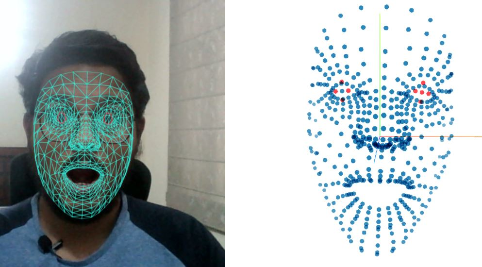

  

# [Count Yawns using Pretrained Facial Keypoint Detector Model]()

This repository hosts code to run a yawn detector and counter in your browser. The code uses a pretrained facial keypoint detector model, hosted on the [tf-js models](https://github.com/tensorflow/tfjs-models) repository. 

The code has been taken from the [facial landmark detector demo](https://github.com/tensorflow/tfjs-models/tree/master/face-landmarks-detection/demo) (FLD) page of the repository and has been refactored to work in the browser using Tensorflow-JS 2.4.0. 

## How Does It Work?

After the FLD model predicts the keypoint location. Lip keypoints (refer to [mesh map](./mesh_map.jpg)) are used to calculate the distance between the upper and lower lips.

The distance is plotted on a line chart for easy visualization. Whenever the distance for increases above a threshold, there is a beep alarm and the yawn counter is raised by one.

## What can YOU Do?

The following are some low hanging fruits for you to try:

- Experiment with different yawn durations.
- Add code to make the yawn counter robust to camera angle changes.
- Add code for automatic threshold calculation.

# Feedback

Please create an issue on this repository or write to us on pretrainedmachines@gmail.com on any issue/thoughts on this repository. 

Follow us on **@pretrainedmchns** on [Twitter](https://twitter.com/pretrainedmchns) and [Github](https://github.com/pretrainedmchns).

We are waiting to hear from you.